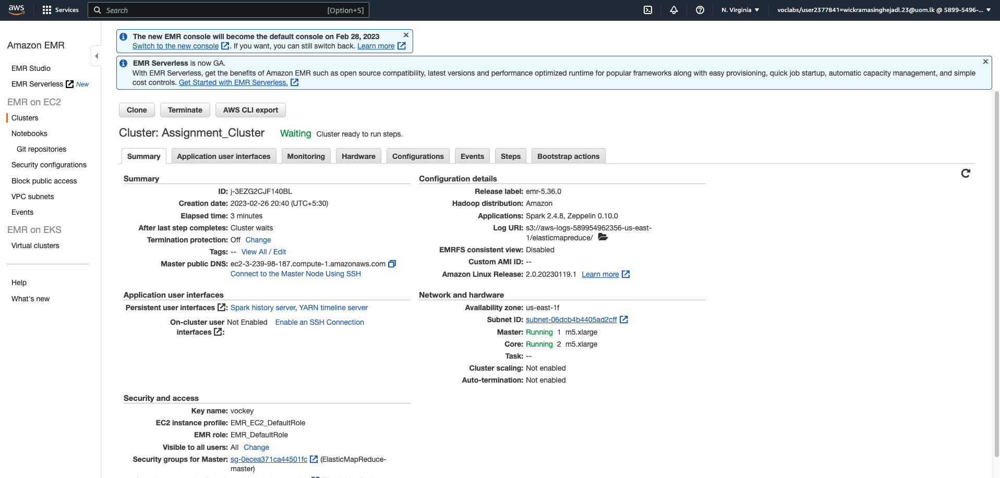
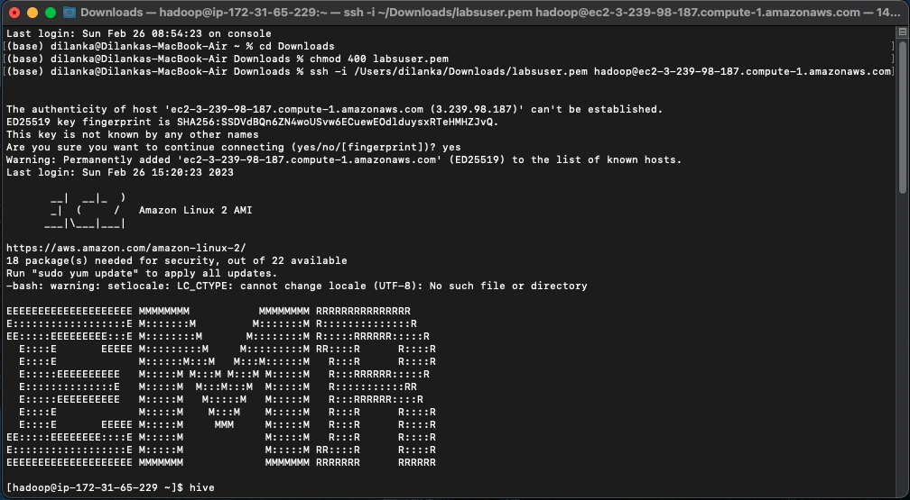
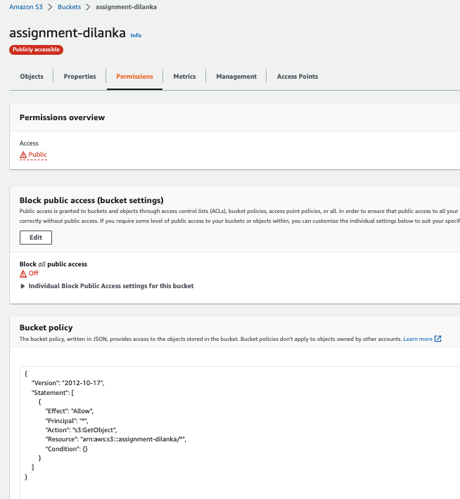

# UoM_MapReduce-vs-Spark
CS5229 - Big Data Analytics Technologies

# How to Set Up Amazon EMR
This guide will walk you through the steps of setting up Amazon EMR. Amazon EMR is a web service that provides a managed cluster platform for processing large amounts of data. This guide assumes that you have an Learner Lab AWS account and basic familiarity with the AWS Management Console.

## Prerequisites
- An AWS account
- Basic familiarity with the AWS Management Console
- Basic knowledge of terminal commands

## Step-by-Step Guide
1. Go to AWS Learner Lab.
2. Click "Start Lab".
3. Click "AWS".
4. Choose "EMR".
5. Click "Create cluster".
6. Select "m4.large".
7. Untick "Auto Termination".
8. For EC2 key pair, choose the "vockey" key pair and download "labsuser.pem".
9. Click "Create cluster".
10. Go to the cluster's Summary >> Security and access >> Security groups for Master.
11. Select the security group for the master node.
12. In the bottom pane, choose the Inbound rules tab, and then choose Edit inbound rules.
13. At the bottom of the page, choose Add rule, and then configure SSH.
14. Type: Choose "SSH".
15. Source: Choose "Anywhere-IPv4".
16. Choose "Save rules".
17. Go to Terminal.
18. cd Downloads.
19. chmod 400 labsuser.pem.
20. ssh -i /Users/dilanka/Downloads/labsuser.pem hadoop@ec2-44-200-14-97.compute-1.amazonaws.com.
21. Go to Amazon S3.
22. Create a Bucket.
23. Update the permission to access public by adding the following policy to your bucket policy:

{
    "Version": "2012-10-17",
    "Statement": [
        {
            "Effect": "Allow",
            "Principal": "*",
            "Action": "s3:GetObject",
            "Resource": "arn:aws:s3:::bucket-test-dilanka-003/*",
            "Condition": {}
        }
    ]
}

24. Create a folder.
25. Upload the dataset to the folder.

## Images

### Cluster Setup

### EMR Terminal View

### S3 Bucket Permission Update

